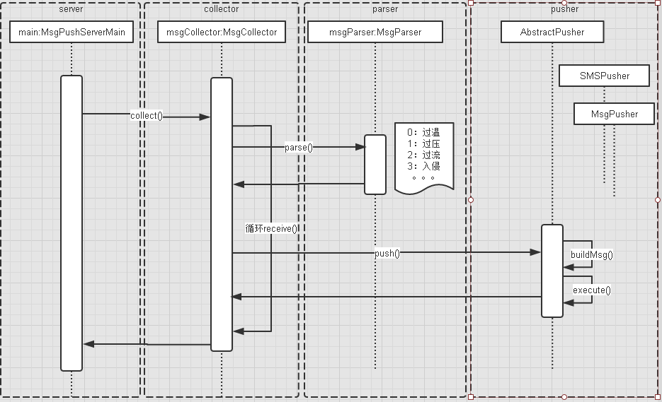

## 消息推送平台设计 ##

消息推送平台主要有三大模块：消息收集，消息解析，消息推送。

### 消息收集 ###

消息收集用来接收来自RabbitMq消息队列的消息，该消息是推给用户的原始数据。

不同的消息ID对应不同的消息类型，
比如：1->状态改变，2->产生报警。
收集报警消息，在RabbitMq上注册MsgId=2即可。
此处只是示例，详见《设备消息结构设计详细说明书》。

收集到的消息供消息解析模块使用。

### 消息解析 ###

从收到的原始数据中解析出有用的数据，解析后的数据应该包含：消息头（包含设备Id），消息体（消息标题，消息内容）。
设备消息体结构设计详细说明书
以产生报警的数据为例，
解析出：比如，产生报警的设备Id，报警类型（过温，过压，过流，入侵)等。
详见《设备消息结构设计详细说明书》。
消息内容根据自定义的消息模板，拼接成面向用户的可理解信息。

封装消息供推送消息模块使用。

### 消息推送 ###

连接第三方推送平台，发送来自数据解析模块的消息。
支持应用推送,短信通知。
应用推送支持：百度推送、激光推送、个推推送。
短信通知支持：麦迅通，

根据消息头内的设备ID，获取与之绑定的用户信息。
不同消息平台封装不同消息。

应用推送API：
待续。。。

短信通知API：
待续。。。

## 消息推送顺序示意图  ##

